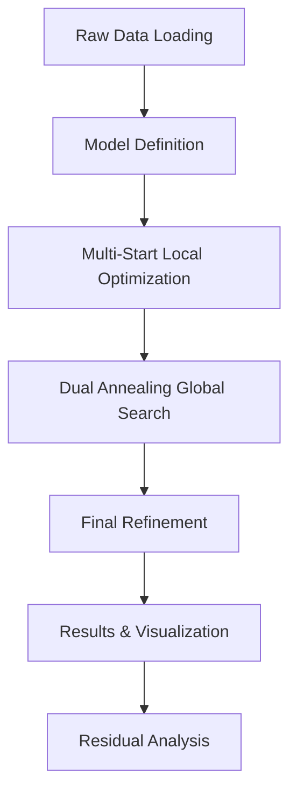

# FLAM_Assignment - Research and Development / AI
Parameter estimation for a nonlinear model using L1 minimization. This repo includes Python code to fit unknown variables to provided data, utilizing multi-start local/global optimization and residual analysis, with step-by-step instructions and results.

# Project Overview: 
The goal is to fit unknown parameters $\theta$, $M$, and $X$ in a nonlinear model to match provided $(x,y)$ data points using advanced optimization methods.

# Mathematical Model: 
The model being fitted:
### X-coordinate:
$$
x(t) = t \cdot \cos(\theta) - e^{M \cdot |t|} \cdot \sin(0.3t) \cdot \sin(\theta) + X
$$
### Y-coordinate:
$$
y(t) = 42 + t \cdot \sin(\theta) + e^{M \cdot |t|} \cdot \sin(0.3t) \cdot \cos(\theta)
$$

# Optimization Objective: 
Minimize the L1 loss function:

$$
\mathcal{L}(\theta, M, X) = \sum_{i=1}^{n} |x_{\text{pred},i} - x_{\text{true},i}| + |y_{\text{pred},i} - y_{\text{true},i}|
$$

Subject to boundary conditions:
- $\theta \in [0, 50^\circ]$
- $M \in [-0.05, 0.05]$
- $X \in [0, 100]$

# Solution Approach

The parameter estimation follows a multi-stage optimization pipeline to overcome local minima and ensure robust convergence to the global optimum.

1. Raw Data Loading
 - Load (x,y) coordinate data from the given CSV file
 - Parameterize the curve using time variable t spanning 6 to 60 units
 - Prepare ground truth data for optimization comparison

2. Model Definition
 - Define nonlinear mathematical model with parameters θ (angle), M (exponential factor), and X (offset) as given in the problem statement

3. Multi-Start Local Optimization
 - Execute L-BFGS-B algorithm from multiple initial parameter guesses
 - Grid search across θ, M and X
 - This helps identify promising regions in parameter space and avoiding local minimas

4. Dual Annealing Global Search
 - Apply global optimization using simulated annealing
 - Helps escape local minimas
 - Explores entire parameter space within defined physical bounds

5. Final Refinement
 - Take best solution from previous stages for improving precision
 - Use L-BFGS-B with tolerance (1e-15) for final convergence
 - This ensures high-precision parameter estimates

6. Results & Visualization
 - Generate comparative plots of fitted vs actual curves
 - Display optimization results with final parameter values
 - Provide quantitative loss metrics 

7. Residual Analysis
 - Compute and visualize differences between predicted and actual values
 - Analyze error patterns to validate model adequacy

# Results & Output

### Optimization Progress
The multi-stage optimization successfully converged to the following parameters:

*Console output showing optimization progress and final parameters*

### Final Optimized Parameters
- **θ** = 21.21124° (0.37021 radians)
- **M** = 0.021189
- **X** = 54.9008
- **L1 Loss** = 37865.0938

## Visualization Results

# Curve Fitting Quality and Residual Analysis

*Comparison between actual data points (blue) and fitted curve (green)*

### Performance Metrics

| Metric | Value |
|--------|-------|
| Final L1 Loss | 37865.09 |
| θ (Angle) | 21.21124° |
| M (Exponential Factor) | 0.021189 |
| X (Offset) | 54.9008 |
| Optimization Method | Hybrid (Multi-start + Dual Annealing) |

